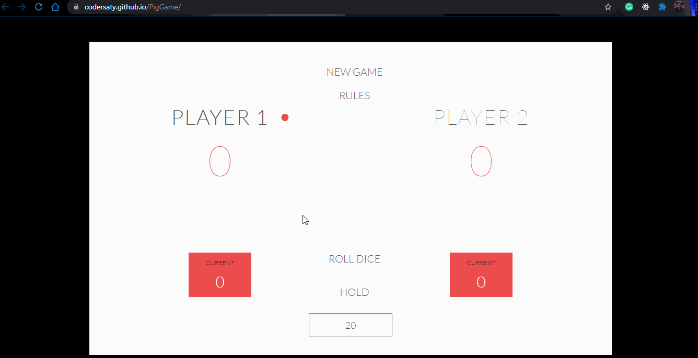

<h1 align="center" id="top">Welcome to PIG Game 👋</h1>

# Basic Overview

> This project is a beautiful website created using HTML and CSS (for layout) to replicate the famous [Pig Game](https://en.wikipedia.org/wiki/Pig_(dice_game)) using JavaScript DOM manipulation for functionality. 
 

# Table of Contents

- [Description](#description)
- [Technologies Used](#technologies)
- [Rules](#Rules)
- [Features](#Features)
- [References](#references)
- [License](#license)
- [ToDos](#To-Dos)
- [Related Projects](#related-projects)
- [Support](#support)
- [Author Info](#author-info)

 

# Description

A simple and easy to use website created using HTML5, CSS and javascript to replicate the famous PIG (dice game).

[Live Demo](https://codersaty.github.io/PigGame/)

 

# Technologies

- [HTML5](https://en.wikipedia.org/wiki/HTML5)
- [CSS3](https://en.wikipedia.org/wiki/CSS)
- [JavaScript](https://en.wikipedia.org/wiki/JavaScript)
- [Git](https://en.wikipedia.org/wiki/Git)
- [Markdown](https://en.wikipedia.org/wiki/Markdown)

### Tools used

- [VS Code](https://en.wikipedia.org/wiki/Visual_Studio_Code)
- [Github](https://en.wikipedia.org/wiki/GitHub)

 

# Rules

- The game has 2 players, playing in rounds.

- In each turn, a player rolls a dice as many times as he whishes. Each result get added to his current ROUND score.

- BUT, if the player rolls a 1, all his current ROUND score gets lost. After that, it's the next
player's turn

- The player can choose to 'Hold', which means that his current ROUND score gets added to his GLOBAL score. After that, it's the next player's turn

- The first player to reach 100 points (by default) or the score specified on the input field on GLOBAL score wins the game

- This game is famously known as <b>PigGame</b>

# Features

- A player looses his ENTIRE score when he rolls two 6 in a row. After that, it's the next player's turn.
- There will be an input field where players can set their own winning score, so that they can change the predefined score of 100.
- Add another dice to the game, so that there are two dices now. The player looses his current score when one of them is a 1.For this we have another JS file named twodice.js in js folder of assests. To play with two dice we have to add that file in our html code and disable the app.js file or you can just replace app.js with twodice.js in the index.html file.

# References

I have used the following resources in creation of this project:

- [The Complete JavaScript Course 2022: From Zero to Expert!](https://www.udemy.com/course/the-complete-javascript-course//)

 

# License

[MIT License](LICENSE.md)

Copyright (c) 2021 @[codersaty](http://codersaty.github.io/Portfolio)

 

# To Dos

> Thinking About it.

 

# Related Projects

> I will add the projects soon.

 

# Support

In case of any problem/ query, feel free to do pull requests or contact the author.

 

# Author Info

- Twitter - [@codersaty](https://twitter.com/codersaty)
- Website - [Anuranjan Srivastava](http://codersaty.github.io/Portfolio)
- Linkedin - [codersaty](https://www.linkedin.com/in/codersaty)

 

[Back To The Top](#top)